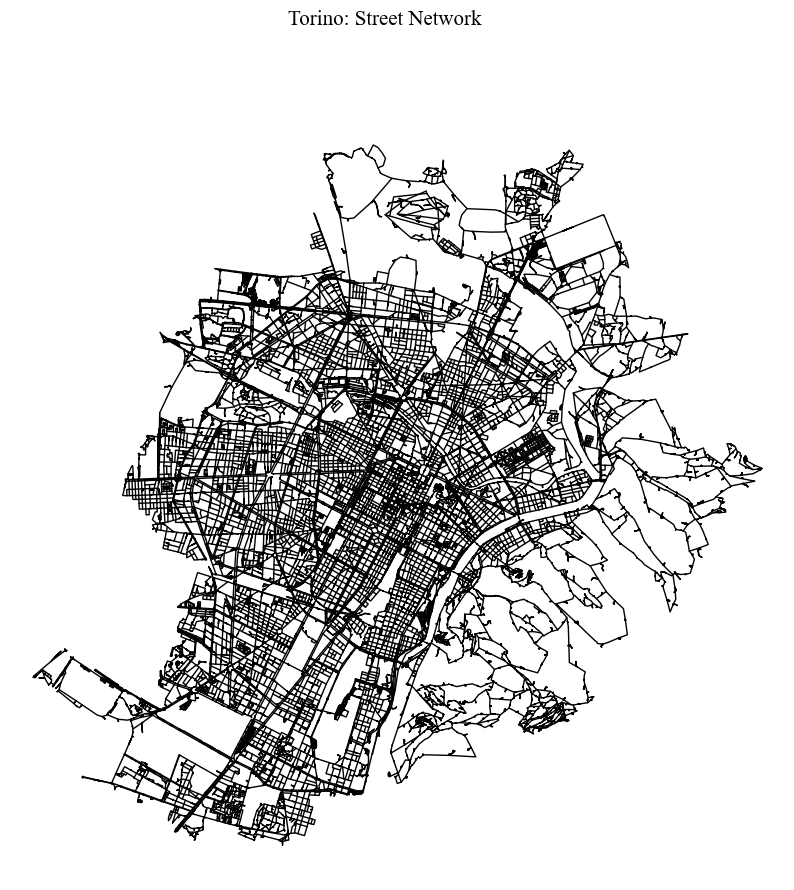
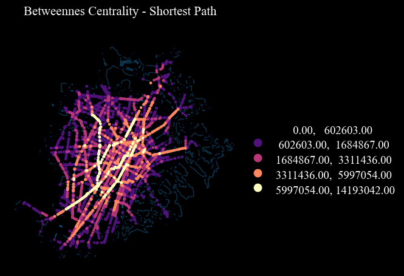
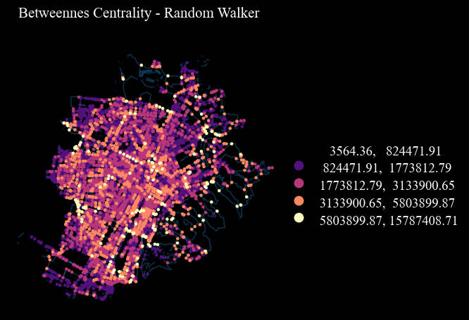
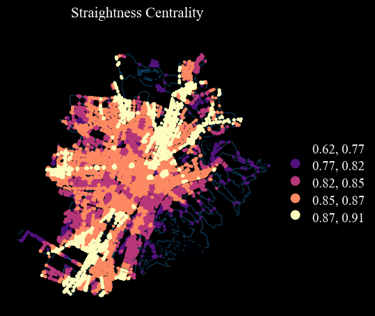
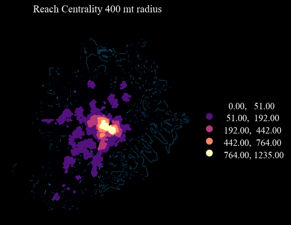
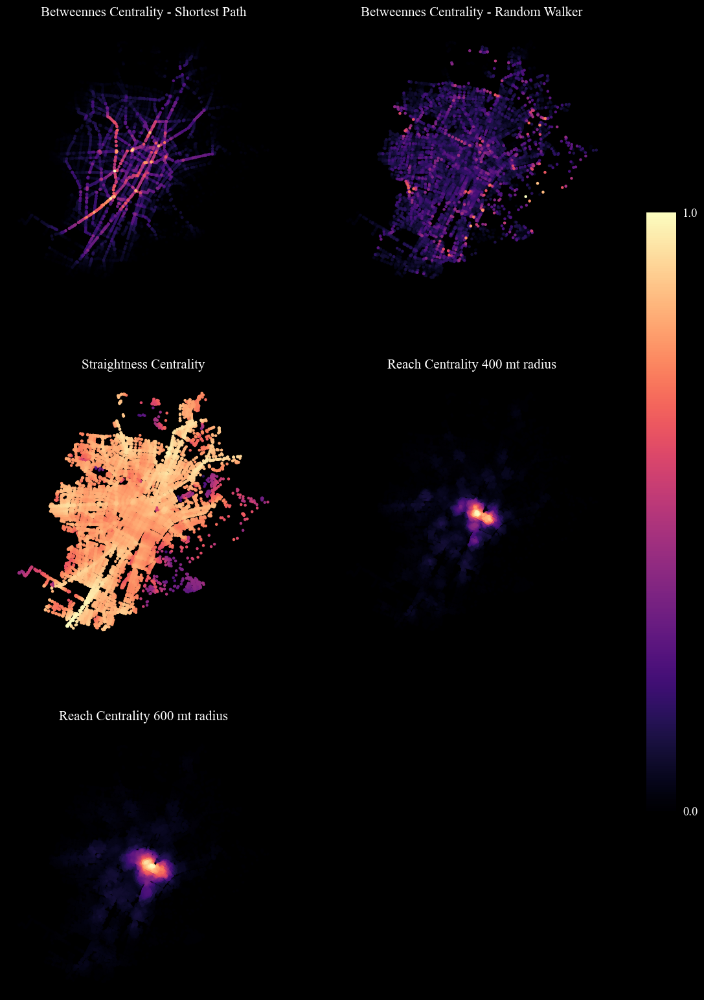
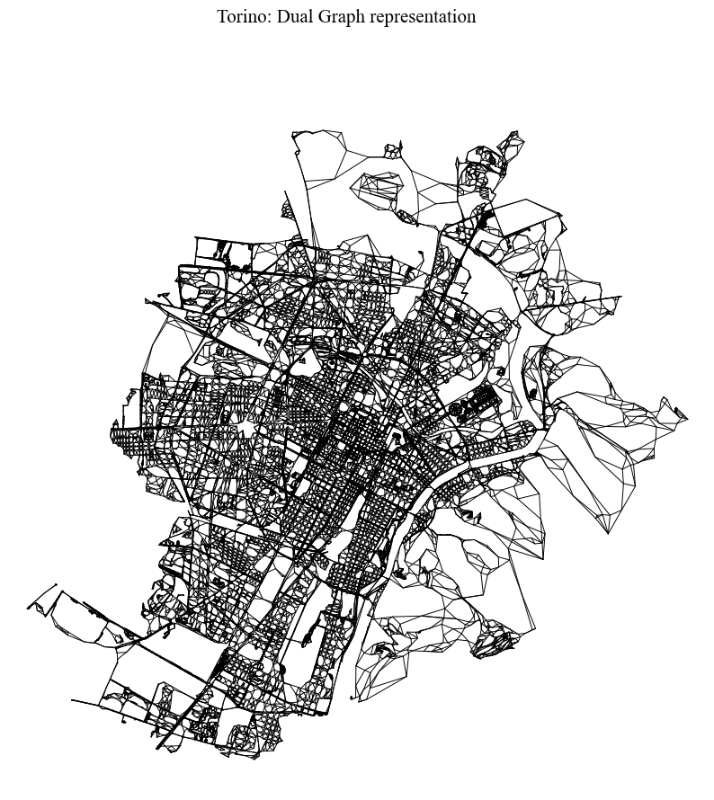
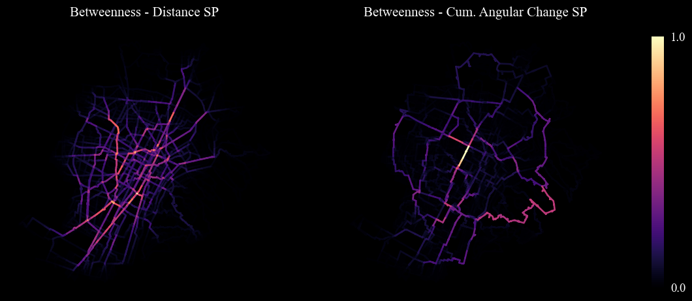

# Street Network Analysis: Nodes and Paths
## Working with OSM data


```python
import osmnx as ox, networkx as nx, matplotlib.cm as cm, pandas as pd, numpy as np
import geopandas as gpd
%matplotlib inline

import warnings
warnings.simplefilter(action="ignore")
pd.options.display.float_format = '{:20.2f}'.format
pd.options.mode.chained_assignment = None

import cityImage as ci
```

## Important: find EPSG of your case-study area
### Specifying the name of the city for convenience


```python
#initialise path, names, etc.

city_name = 'Torino'
epsg = 32632
crs = 'EPSG:'+str(epsg)
```

## 1. Downloading the data from OpenStreetMap

Choose the name of the place that represent your case-study area. When the case-study area does not coincide with the entire extension of a city, it is suggested to include the case-study area's surroundings (e.g. buffer of 2000 mt from the centre of the area, depending on its extension) so to avoid the edge effect when computing the centrality measures.

Choose between the following methods:
* `OSMplace`, providing an OSM place name (e.g. City).
* `OSMpolygon`, provide a Polygon (coordinates must be in units of latitude-longitude degrees).
* `distance_from_address`, providing a precise address and setting the `distance` parameter (which is otherwise not necessary)


```python
place = 'Torino, Italy'
download_method = 'OSMplace'
distance = None

nodes_graph, edges_graph = ci.get_network_fromOSM(place, download_method, 'walk', distance = distance, epsg = epsg)
```

## 2 Cleaning and simplyfing the Street Network - gdf

At the end of the previous section two files are obtained: nodes and edges (vertexes and links). Below, before creating the actual graph, the two datasets are cleaned, simplified and corrected.

Cleaning functions handle (through boolean parameters):
* Duplicate geometries (nodes, edges).
* Pseudo-nodes.
* `remove_islands`: Disconnected islands.
* `dead_ends` Dead-end street segments.
* `self_loops` Self-Loops.
* `same_vertexes_edges` Edges with same from-to nodes, but different geometries.
* `fix_topology` This creates nodes and breaks street segments at intersections. It is primarily useful for poorly formed datasets (usually OSM deerived networks are topologically correct). It accounts for segments classified as bridges or tunnels in OSM.

`same_vertexes_edges` handles edges with same pair of u-v nodes but different geometries. When `True`, it derives a center line between the two segments, unless one of the two segments is longer than the other (>10%). In this case, the shorter segment is deleted.


```python
nodes_graph, edges_graph = ci.clean_network(nodes_graph, edges_graph, dead_ends = True, remove_islands = True,
                            same_vertexes_edges = True, self_loops = True, fix_topology = False)
```


```python
plot = ci.plot_gdf(edges_graph, black_background = False, figsize = (10,10), title = city_name+': Street Network',
                   color = 'black')
```


    

    


```python
# Obtaining the graph from the case-study area and computing the centrality measures
graph = ci.graph_fromGDF(nodes_graph, edges_graph)
```

## 3. - Nodes centrality

On the primal graph representation of the street network, the following centrality measures are computed on nodes, on the basis of road distance:

* Road Distance Shortest Path Betweenness centrality (`Bc_Rd`).
* Information Centrality (`Bc_Rw`)
* Straightness centrality (`Sc`) (see [Crucitti et al. 2006](https://journals.aps.org/pre/abstract/10.1103/PhysRevE.73.036125)).
* Reach centrality (e.g. `Rc_400`, `Rc_600`) (readataped from [Sevtsuk & Mekonnen 2012](https://www.sutd.edu.sg/cmsresource/idc/papers/2012_Urban_Network_Analysis_A%20New%20Toolbox_for_ArcGIS.pdf)) - it measures the importance of a node based on the number of services (e.g. commercial activities) reachable by that node (for instance within a buffer).

`measure` accepts `betweenness_centrality`, `information_centrality`, `straightness_centrality`, `closeness_centrality`. The function returns dictionaries, which are going to be merged in the GDF below.

The first measure (`Bc_Rd`) is here used to identify "Lynchian" nodes. 


```python
# betweenness centrality
Bc_Rd = ci.centrality(graph, nodes_graph, measure = "betweenness_centrality", weight = 'length', normalized = False)
# information centrality
Bc_Rw =  ci.centrality(graph, nodes_graph, measure ="information_centrality", weight = 'length', normalized = False)
# straightness centrality
Sc = ci.centrality(graph, nodes_graph, measure = "straightness_centrality", weight = 'length', normalized = False)
```

#### Choose which of the following amenities you consider relevant as "services" for computing reach centrlality. Check [OSM amenities](https://wiki.openstreetmap.org/wiki/Key:amenity) for details


```python
amenities = ['arts_centre', 'atm', 'bank', 'bar', 'bbq', 'bicycle_rental', 'bicycle_repair_station', 'biergarten', 
             'boat_rental', 'boat_sharing', 'brothel', 'bureau_de_change', 'cafe', 'car_rental', 'car_sharing', 'car_wash', 'casino', 'childcare',
           'cinema', 'clinic', 'college', 'community_centre', 'courthouse', 'crematorium', 'dentist', 'dive_centre', 'doctors', 
           'driving_school', 'embassy', 'fast_food', 'ferry_terminal', 'fire_station', 'food_court', 'fuel', 'gambling', 'gym', 
           'hospital', 'ice_cream', 'internet_cafe', 'kindergarten', 'kitchen', 'language_school', 'library', 'marketplace', 
           'monastery', 'motorcycle_parking', 'music_school', 'nightclub', 'nursing_home', 'pharmacy', 'place_of_worship', 
           'planetarium', 'police', 'post_office', 'prison', 'pub', 'public_building', 'ranger_station', 'restaurant', 'sauna',
           'school', 'shelter', 'shower', 'social_centre', 'social_facility', 'stripclub', 'studio', 'swingerclub', 'theatre', 
           'toilets', 'townhall', 'university', 'veterinary']
```


```python
# reach centrality pre-computation, in relation to Point of Interests or any other point-geodataframes 
services = ox.geometries.geometries_from_place(place, tags = {'amenity':True}).to_crs(epsg=epsg)
services = services[services.amenity.isin(amenities)]
services = services[services['geometry'].geom_type == 'Point']

# using a 50 mt buffer
graph = ci.weight_nodes(nodes_graph, services, graph, field_name = 'services',  radius = 50)

# Reach Centrality
Rc400 = ci.reach_centrality(graph, weight = 'length', radius = 400, attribute = 'services') 
Rc600 = ci.reach_centrality(graph, weight = 'length', radius = 600, attribute = 'services')
```


```python
## Appending the attributes to the geodataframe
dicts = [Bc_Rd, Bc_Rw, Sc, Rc400, Rc600]
columns = ['Bc_Rd', 'Bc_Rw', 'Sc', 'Rc400', 'Rc600']
for n,c in enumerate(dicts): 
    nodes_graph[columns[n]] = nodes_graph.nodeID.map(c)
```

### 3.1 Nodes' centrality - Visualisation


```python
columns = ['Bc_Rd', 'Bc_Rw', 'Sc', 'Rc400', 'Rc600']
titles = ['Betweennes Centrality - Shortest Path', 'Betweennes Centrality - Random Walker', 
         'Straightness Centrality', 'Reach Centrality 400 mt radius', 'Reach Centrality 600 mt radius']
```

### Parameters 

##### Plot properties (optional):
* `black_background` black background or white
* `figsize`: size of the figure's side extent (15,10)
* `legend`: if True, show the legend
* `axes_frame`: if True, it shows an axis frame
* `fontsize`: the fontsize for texts

##### What to plot (some may be required, depending on the function):
* `gdf`: the gdf to plot (only for the functions `plot_gdf` and `plot_grid_gdf_columns`)
    * `gdfs`: list of GeoDataFrames to plot (only for the function `plot_grid_gdfs_column`)
* `column`: the column of the gdf on which building the visualisation (only for the functions `plot_gdf` and `plot_grid_gdf_columns`)
    * `columns`: list of the columns on which building the visualisation (only for the function `plot_grid_gdf_columns`)

##### How to plot (optional):
* `scheme`: the classification method, choose amongst: https://pysal.org/mapclassify/api.html
* `bins`: bins defined by the user
* `classes`: nr classes for visualising when scheme is not None
* `norm`: a desired data normalisation into a [min, max] interval
* `cmap`: see matplotlib colormaps for a list of possible values or pass a colormap
* `color`: categorical color applied to all geometries when not using a column to color them
* `alpha`: alpha value of the plotted layer
* `geometry_size` point size or line with value values, based on the geometry
* `geoemtry_size_factor`: when provided, it rescales the column provided, if any, from 0 to 1 and it uses the geoemtry_size_factor to rescale the markersize or the linewidth accordingly (e.g. rescaled variable's value [0-1] * factor), when plotting a Point GeoDataFrame

* `cbar`: if True, show colorbar, otherwise don't; when True it doesn't show legend. Related paramters are:
    * `cbar_shrinkage`: fraction by which to multiply the size of the colorbar.
    * `cbar_ticks`:  number of ticks along the colorbar
    * `cbar_max_symbol`:  if True, it shows the ">" next to the highest tick's label in the colorbar (useful when normalising)
    * `cbar_min_max`: if True, it only shows the ">" and "<" as labels of the lowest and highest ticks' the colorbar

* `gdf_base_map`, provide a GeoDataFrame that should be used as base-map. Related paramters are:        
    * `base_map_gdf`: a desired additional layer to use as a base map        
    * `base_map_color`color applied to all geometries of the base map
    * `base_map_alpha`: base map's alpha value
    * `base_map_geometry_size`: base map's markersize or linewidth when the base map is a Point GeoDataFrame or a LineString GeoDataFrame
    * `base_map_zorder`: zorder of the layer; e.g. if 0, plots first, thus main GeoDataFrame on top; if 1, plots last, thus on 
    
##### Only for grid-like plot (multi gdfs or multi columns):
* `nrows`: number of rows of the subplot
* `ncols`: number of columns of the subplot

nrows x ncols must be equal (or +1) to the lenght of the gdfs or columns passed

#### Single figure visualisation with Lynch-like Breaks


```python
for n, column in enumerate(columns):
    #rescaling values for 0-1 visualisation
    ci.plot_gdf(nodes_graph, column = column, title = titles[n], cmap = 'magma', classes = 5, scheme = 'natural_breaks',
                geometry_size = 5, figsize = (5,5), base_map_gdf = edges_graph, base_map_zorder = 0, 
                legend = True)
```


    

    


    

    


    

    



    


       

    


#### Grid visualisation


```python
# Lynch's bins - only for variables from 0 to 1 
scheme_dict = {'bins' : [0.125, 0.25, 0.5, 0.75, 1.00], 'scheme' : 'User_Defined'}
cbar_dict = {'cbar' : True, 'cbar_min_max' : True, 'cbar_shrinkage' : 0.60}

#rescaling values for 0-1 visualisation
for n, column in enumerate(columns):
    nodes_graph[column+'_sc'] = ci.scaling_columnDF(nodes_graph[column])

columns_rescaled = [column+'_sc' for column in columns]
fig = ci.plot_grid_gdf_columns(nodes_graph, titles = titles, columns = columns_rescaled, cmap = 'magma', figsize = (15,20),
                    nrows = 3, ncols = 2,  geometry_size = 5, **cbar_dict)
```


    

    


## 4. Paths

On the primal graph representation of the street network, the following centrality measures are computed on edges:
* Road Distance Betweenness centrality.
* Angular Betweenness centrality (On the dual graph representation of the street network)


```python
# Road Distance betweenness centrality
Eb = nx.edge_betweenness_centrality(graph, weight = 'length', normalized = False)
```


```python
# appending to the geodataframe
edges_graph.drop(['Eb'], axis = 1, inplace = True, errors = 'ignore')
edges_graph = ci.append_edges_metrics(edges_graph, graph, [Eb], ['Eb'])
```

### 4.1 Dual graph analysis

Here street-segments are transformed into nodes (geograpically represented by their centroids). Fictional links represent instead intersections. Thus if two segments are connected in the actual street network, a link in the dual graph representation will be created by connecting the corresponding nodes. 
This process allows to take advantage of angular relationships in centrality measures computation and other network operations.


```python
# Creating the dual geodataframes and the dual graph.
nodesDual_graph, edgesDual_graph = ci.dual_gdf(nodes_graph, edges_graph, epsg)
dual_graph = ci.dual_graph_fromGDF(nodesDual_graph, edgesDual_graph)
```


    


```python
plot = ci.plot_gdf(edgesDual_graph, black_background = False, figsize = (10,10), title = city_name+': Dual Graph representation', 
             color = 'black', geometry_size = 0.7)
```


    

    


```python
# Angular-change betweenness centrality
Ab = nx.betweenness_centrality(dual_graph, weight = 'rad', normalized = False)
edges_graph['Ab'] = edges_graph.edgeID.map(Ab)
```

### 4.2 Paths (Edges' centrality) visualisation


```python
columns = ['Eb', 'Ab']
titles = ['Betweenness - Distance SP', 'Betweenness - Cum. Angular Change SP']
cbar_dict = {'cbar' : True, 'cbar_min_max' : True, 'cbar_shrinkage' : 0.50}

for n, column in enumerate(columns):
    edges_graph[column+'_sc'] = ci.scaling_columnDF(edges_graph[column])
    
columns_rescaled = [column+'_sc' for column in columns]    
plot = ci.plot_grid_gdf_columns(edges_graph, classes = 8, columns = columns_rescaled, titles = titles, geometry_size = 1.9, 
                                nrows = 1, ncols = 2, scheme = 'Natural_Breaks', cmap = 'magma', figsize = (15 ,10),
                                **cbar_dict)
```


    

    


## Exporting


```python
# provide path
saving_path = 'Outputs/'+city_name+'/'

# primal graph
nodes_graph.to_file(saving_path+city_name+'_nodes.shp', driver='ESRI Shapefile')
edges_graph.to_file(saving_path+city_name+'_edges.shp', driver ='ESRI Shapefile')

# dual graph
nodesDual_graph.drop('intersecting', axis=1).to_file(saving_path+city_name+'_nodesDual.shp', driver = 'ESRI Shapefile')
edgesDual_graph.to_file(saving_path+city_name+'_edgesDual.shp', driver = 'ESRI Shapefile')
```

