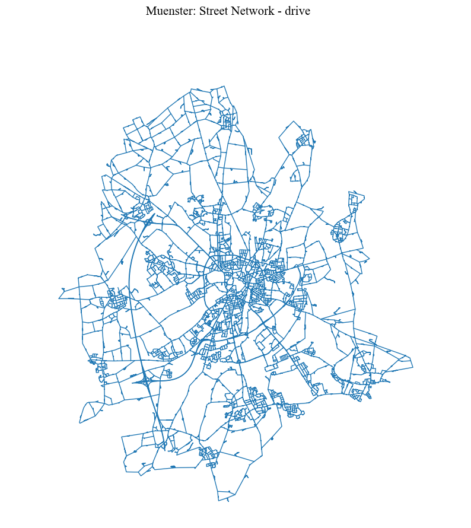
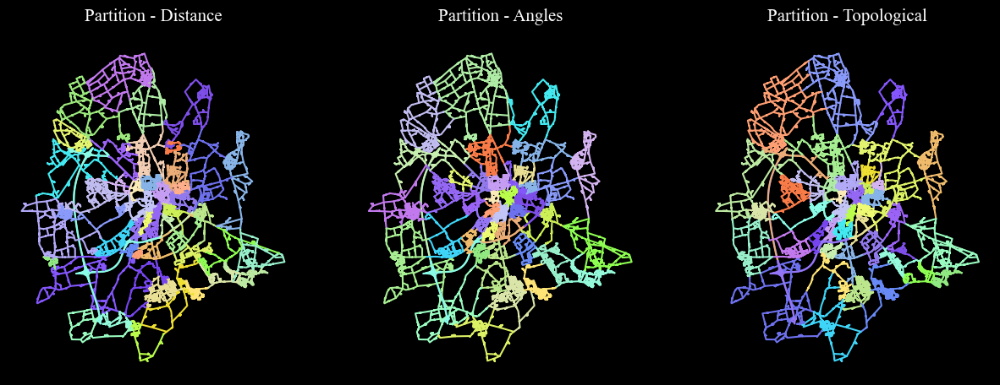
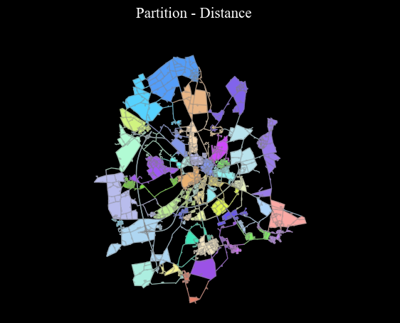
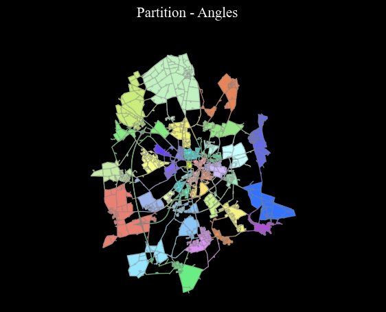
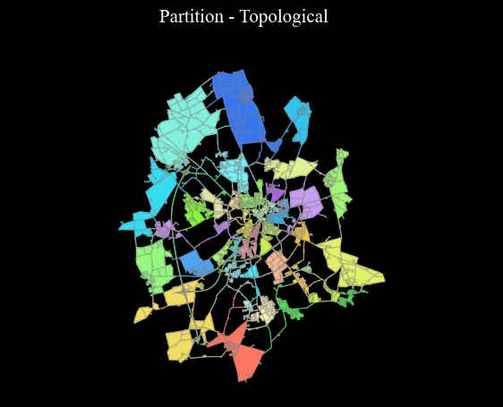
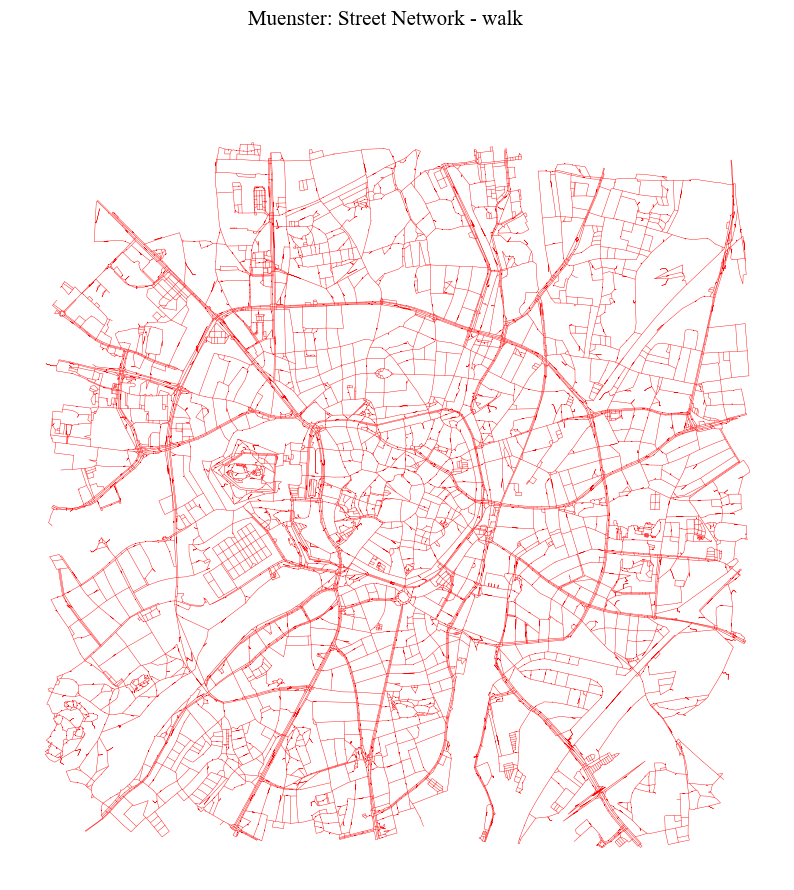
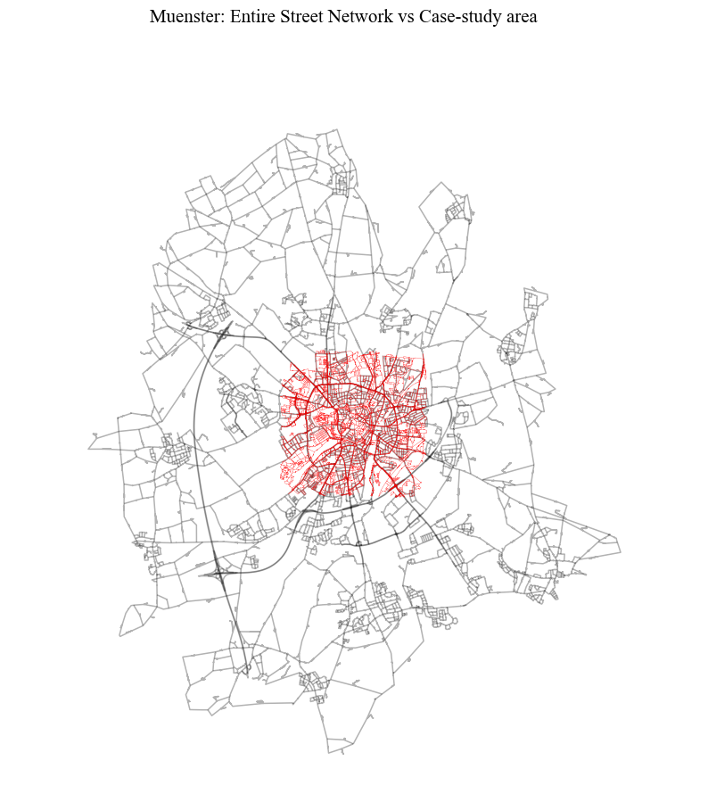
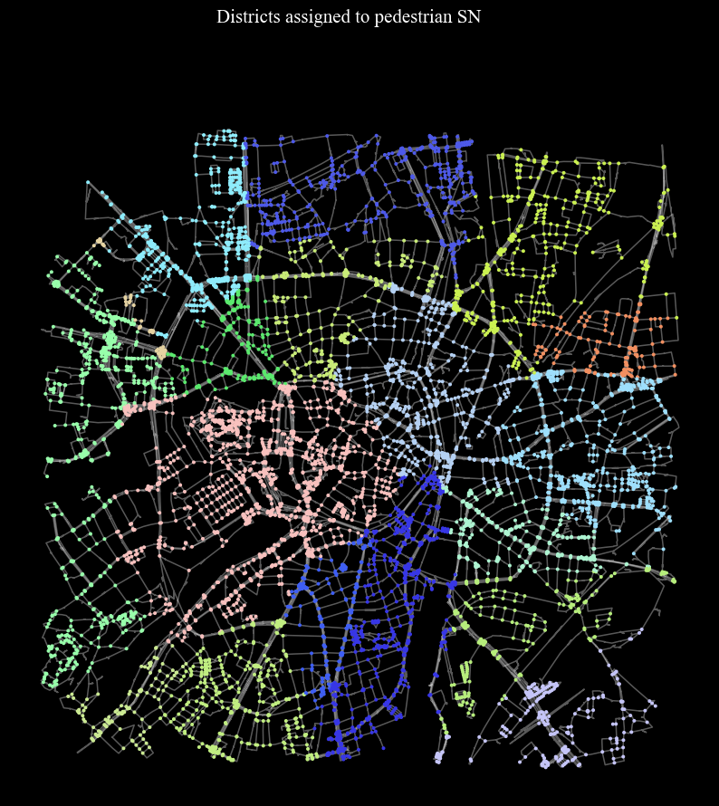
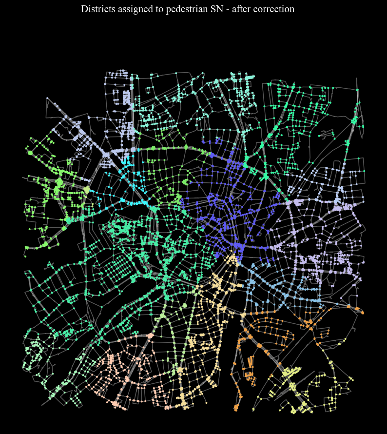

# Street Network Analysis: District Identification


```python
import osmnx as ox, networkx as nx, matplotlib.cm as cm, pandas as pd, numpy as np
import geopandas as gpd
from shapely.geometry import Point, mapping
%matplotlib inline

import warnings
warnings.simplefilter(action="ignore")
pd.options.display.float_format = '{:20.2f}'.format
pd.options.mode.chained_assignment = None

import cityImage as ci
```


```python
# Important: find EPSG of your case-study area
# Initialise path, names, etc.

city_name = 'Muenster'
epsg = 25832
crs = 'EPSG:'+str(epsg)
```
## 0. Define the network representing a larger area around and including the case-study area.
For example, if one is interested in finding regions in the city center of Berlin, the indentification of the regions should be performed for the entire city or the Metropolitan area.
Afterwards (see below) such districts should be assigned to the case study area. This is not mandatory but the algorithm is sensitive to the geographical extent of the area considered. 
Smaller areas will produce smaller regions.

Moreover, it is advised to use vehicular streets only at this stage. 

### 0.0 Download from OSM the drive network

Choose between the following methods:

* `OSMplace`, providing an OSM place name (e.g. City).
* `polygon`, providing a Polygon (coordinates must be in units of latitude-longitude degrees).
* `distance_from_address`, providing a precise address and setting the `distance` parameter.
* `distance_from_point`, providing point coordinates (in units of latitude-longitude degrees) and setting the `distance` parameter to build the bounding box around the point.


```python
place = 'Muenster, Germany'
download_method = 'OSMplace'
distance = None

nodes_graph, edges_graph = ci.get_network_fromOSM(place, download_method, 'drive', epsg, distance = distance)
nodes_graph, edges_graph = ci.clean_network(nodes_graph, edges_graph, dead_ends = True, remove_islands = True,
                            self_loops = True, same_vertexes_edges = True)

# Creating and saving the dual geodataframes
nodesDual_graph, edgesDual_graph = ci.dual_gdf(nodes_graph, edges_graph, epsg)
```

### 0.1 Alternatively, load from local path (when the user has already processed the network)


```python
input_path = 'Outputs/'+city_name+'/entireNetwork/'

nodes_graph = gpd.read_file(input_path+city_name+'_nodes.shp')
edges_graph = gpd.read_file(input_path+city_name+'_edges.shp')
nodesDual_graph = gpd.read_file(input_path+city_name+'_nodesDual.shp')
edgesDual_graph = gpd.read_file(input_path+city_name+'_edgesDual.shp')

try:
    nodes_graph, edges_graph = nodes_graph.to_crs(epsg=epsg), edges_graph.to_crs(epsg=epsg)
    nodesDual_graph, edgesDual_graph = nodesDual_graph.to_crs(epsg=epsg), edgesDual_graph.to_crs(epsg=epsg)
except:
    nodes_graph.crs, edges_graph.crs = crs, crs
    nodesDual_graph.crs, edgesDual_graph.crs = crs, crs
    
nodes_graph.index, edges_graph.index, nodesDual_graph.index = nodes_graph.nodeID, edges_graph.edgeID, nodesDual_graph.edgeID
nodes_graph.index.name, edges_graph.index.name, nodesDual_graph.index.name = None, None, None
```

### Visualise 


```python
fig = ci.plot_gdf(edges_graph, black_background = False, figsize = (10,10), title = city_name+': Street Network - drive')
```


    

    


## 1. District identification


```python
# creating dual_graph
dual_graph = ci.dual_graph_fromGDF(nodesDual_graph, edgesDual_graph)
```

Different weights can be used to extract the partitions. `None` indicates that no weights will be used 
(only topological relationships will matter). The function returns a GeoDataFrame with partitions assigned to edges,
with column named as `p_name_weight` (e.g. `p_length`).


```python
weights = ['length', 'rad', None]
districts = edges_graph.copy()
for weight in weights:
    districts = ci.identify_regions(dual_graph, districts, weight = weight)
```


```python
# visualising
columns = ['p_length','p_rad', 'p_topo']
titles = ['Partition - Distance', 'Partition - Angles', 'Partition - Topological']

nlabels = max([len(districts[column].unique()) for column in columns])
cmap = ci.rand_cmap(nlabels = nlabels, type_color='bright')
fig = ci.plot_grid_gdf_columns(districts, columns = columns, titles = titles, geometry_size = 1.5, cmap = cmap, black_background = True, 
                  legend = False, figsize = (15, 10), ncols = 3, nrows = 1)
```


    

    


### 1.1 District polygonisation
```python
for n, column in enumerate(columns):
    cmap = ci.rand_cmap(nlabels = len(districts[column].unique()), type_color='bright')
    partitions = ci.polygonise_partitions(districts, column, convex_hull = False)
    ci.plot_gdf(partitions, column = column, cmap = cmap, title =  titles[n], black_background = True,  figsize = (7, 5), 
               base_map_gdf = districts, base_map_color = 'grey', base_map_zorder = 1)
```


    

    


    

    


    

    


```python
# saving
saving_path = 'Outputs/'+city_name+'/entireNetwork/'
districts.to_file(saving_path+city_name+"_edges.shp", driver='ESRI Shapefile')
```

## 2. Assigning regions to the (Pedestrian) street network of the case-study area 
This set of functions assigns regions to a walkable network for further modelling in Pedestrian Simulation, for example. The simply identifiaction of regions (districts) from the urban configuration ends above.

### 2.1 Case-study area obtained from OSM:

Choose between the following methods:

* `OSMplace`, providing an OSM place name (e.g. City).
* `polygon`, providing a Polygon (coordinates must be in units of latitude-longitude degrees).
* `distance_from_address`, providing a precise address and setting the `distance` parameter.
* `distance_from_point`, providing point coordinates (in units of latitude-longitude degrees) and setting the `distance` parameter to build the bounding box around the point.

```python
place = 'Domplatz, Muenster, Germany' ## must be different from the area used for the drive network
download_method = 'distance_from_address'
distance = 2500

nodes_graph_ped, edges_graph_ped = ci.get_network_fromOSM(place, download_method, 'walk', epsg, distance = distance)
nodes_graph_ped, edges_graph_ped = ci.clean_network(nodes_graph_ped, edges_graph_ped, dead_ends = True, 
                                remove_islands = True, self_loops = True, same_vertexes_edges = True)
```

### 2.2 Case-study area (pedestrian walkable network) already obtained via notebook 01-Nodes_Paths. 

```python
input_path = 'Outputs/'+city_name+'/'
nodes_graph_ped = gpd.read_file(input_path+city_name+'_nodes.shp')
edges_graph_ped = gpd.read_file(input_path+city_name+'_edges.shp')

try:
    nodes_graph_ped, edges_graph_ped = nodes_graph_ped.to_crs(epsg=epsg), edges_graph_ped.to_crs(epsg=epsg)
except:
    nodes_graph_ped.crs, edges_graph_ped.crs = crs, crs

nodes_graph_ped.index, edges_graph_ped.index  = nodes_graph_ped.nodeID, edges_graph_ped.edgeID
nodes_graph_ped.index.name, edges_graph_ped.index.name  = None, None
```

### 2.3. Comparing drive vs walk Networks.


```python
fig = ci.plot_gdf(edges_graph_ped, black_background = False, figsize = (10,10), title = city_name+': Street Network - walk',  
                  color = 'red', geometry_size = 0.3)
```


    

    


```python
fig = ci.plot_gdf(edges_graph_ped, scheme = None,  black_background = False, figsize = (10,10), title = 
              city_name+': Entire Street Network vs Case-study area', color = 'red', geometry_size = 0.2,
             base_map_gdf = edges_graph, base_map_color = 'black', base_map_alpha = 0.3)
```


    

    


## 3. Assigning nodes and edges in the pedestrian network to partitions


```python
# choosing the type of partition to be used
column = 'p_length'
min_size_district = 10
```


```python
dc = dict(districts[column].value_counts())

## ignore small portions
to_ignore = {k: v for k, v in dc.items() if v <= min_size_district} 
tmp = districts[~((districts[column].isin(to_ignore))| (districts[column] == 999999))].copy()

partitions = ci.polygonise_partitions(tmp, column)
nodes_graph_ped = ci.district_to_nodes_from_polygons(nodes_graph_ped, partitions, column)
nodes_graph_ped[column] = nodes_graph_ped[column].astype(int)
```


```python
# visualisation
cmap = ci.rand_cmap(nlabels = len(nodes_graph_ped[column].unique()), type_color='bright')
fig = ci.plot_gdf(nodes_graph_ped, column = column, title = 'Districts assigned to pedestrian SN', cmap = cmap, 
                  geometry_size = 3.5, base_map_gdf = edges_graph_ped, base_map_color = 'white', base_map_alpha = 0.35,
                black_background = True, legend = False, figsize = (10,10))
```


    

    


### 3.1 Fixing disconnected and not valid districts, and assigning nodes to existing connected districts


```python
nodes_graph_ped = ci.amend_nodes_membership(nodes_graph_ped, edges_graph_ped, column, min_size_district)
   
# assigning gateways
nodes_graph_ped = ci.find_gateways(nodes_graph_ped, edges_graph_ped, column)
```

### 3.2 Final division


```python
cmap = ci.rand_cmap(nlabels = len(nodes_graph_ped[column].unique()), type_color='bright')
fig = ci.plot_gdf(nodes_graph_ped, column = column, title = 'Districts assigned to pedestrian SN - after correction', 
               cmap = cmap, geometry_size = 3.5, base_map_gdf = edges_graph_ped, base_map_color = 'white', 
                  base_map_alpha = 0.35, black_background = True, legend = False, figsize = (10,10))
```


    

    


```python
nodes_graph_ped['district'] = nodes_graph_ped[column].astype(int)
```

## Saving

```python
saving_path = 'Outputs/'+city_name+'/'
nodes_graph_ped.to_file(saving_path+city_name+"_nodes.shp", driver='ESRI Shapefile')
edges_graph_ped.to_file(saving_path+city_name+"_edges.shp", driver='ESRI Shapefile')
```
